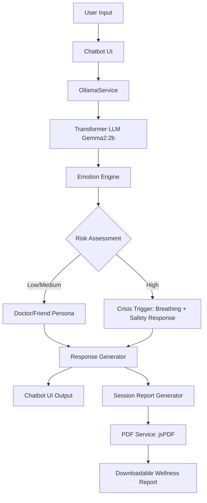

# 🌿 MindfulChat – Emotion-Aware AI Chatbot

> **An Intelligent, Empathetic, and Privacy-Focused Mental Wellness Companion**

[](https://opensource.org/licenses/MIT)
[](https://vitejs.dev/)
[](https://reactjs.org/)
[](https://ollama.com/)

---

## 📖 Abstract
**MindfulChat** is an ethically designed, emotion-aware AI chatbot that leverages **Transformer-based Large Language Models (LLMs)** to provide real-time therapeutic assistance. The system integrates sentiment analysis, dynamic persona adaptation, and proactive risk assessment to deliver personalized wellness guidance. With multilingual support and structured analytics, MindfulChat aims to democratize mental health resources while maintaining strict privacy via local AI processing.

## 🏗️ Architecture



---

## 📸 Demo

<div align="center">
  
  <p><em>Main Chat Interface with Emotion Detection</em></p>
  
  
  <p><em>Professional Session Report Generation</em></p>
  
  
  <p><em>Responsive Mobile-First Design</em></p>
</div>

---

## ⚙️ Setup Instructions

### 1. Prerequisite: Local AI with Ollama
1. Install and run **Ollama** locally from [ollama.com](https://ollama.com).
2. Pull the required model:
   ```bash
   ollama pull gemma2:2b
   ```

### 2. Application Setup
1. **Clone & Install**:
   ```bash
   git clone https://github.com/skarthi369/mental-wellness-chatbot-ai-agent-.git
   cd mental-wellness-chatbot-ai-agent-
   npm install
   ```

2. **Environment Configuration**:
   Create a `.env` file in the root directory:
   ```env
   VITE_OLLAMA_API_URL=http://localhost:11434
   VITE_OLLAMA_MODEL=gemma2:2b
   ```

3. **Run Development Server**:
   ```bash
   npm run dev
   ```

---

## 🎯 Example Conversation Flow

| Scenario | Mode | Interaction |
| :--- | :--- | :--- |
| **Greeting** | Friend | `User: hello machie` <br> `Bot: Heyyy 🚀 glad you dropped in! How’s your vibe tonight?` |
| **Venting** | Doctor | `User: I’m feeling stressed about work.` <br> `Bot: I hear you. Let’s break this down step by step. Can you rate your stress from 1–10?` |
| **Crisis** | Safety | `User: I don’t want to live anymore.` <br> `Bot: 🚨 I hear your pain. Let’s breathe together: inhale 4, hold 4, exhale 6...` |

---

## 📑 Reporting & Analytics

At the end of each session, MindfulChat generates a structured analysis converted into a professional PDF report:

- **Emotional Trends**: Analyzes primary and secondary emotions throughout the session.
- **Risk Assessment**: Categorizes levels (Low/Medium/High) based on linguistic cues.
- **Actionable Interventions**: Suggests specific exercises (Breathing, Meditation, etc.).
- **Professional PDF**: Downloadable summary for personal reflection or clinician sharing.

---

## 🛠️ Tech Stack

- **Frontend**: Vite, React, TypeScript
- **Styling**: Tailwind CSS, Shadcn/UI
- **Animations**: Framer Motion, Lucide React
- **AI Core**: Ollama (Gemma2), Custom Sentiment Engine
- **Reporting**: jsPDF, jsPDF-AutoTable
- **State Management**: React Hooks

---

## 🏆 Acknowledgements

*"Design and Development of an Emotion‑Aware AI Chatbot for Personalized Mental Health Support"*

---
